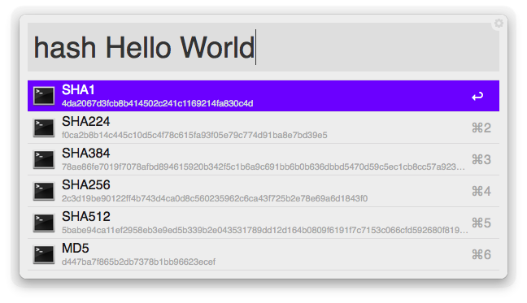

#Hash Workflow for Alfred ([Download](https://github.com/soulwire/alfred-hash-workflow/raw/master/hash.alfredworkflow))

Generate hashes for strings via Alfred using various algorithms including [MD5](http://en.wikipedia.org/wiki/MD5), [SHA1](http://en.wikipedia.org/wiki/SHA1), [SHA224](http://en.wikipedia.org/wiki/SHA224), [SHA256](http://en.wikipedia.org/wiki/SHA256), [SHA384](http://en.wikipedia.org/wiki/SHA384) and [SHA512](http://en.wikipedia.org/wiki/SHA512)

## Requirements
1. [Alfred App v2](http://www.alfredapp.com/#download)
1. [Alfred Powerpack](https://buy.alfredapp.com/)

## Installing
1. [Download](https://github.com/soulwire/alfred-hash-workflow/raw/master/hash.alfredworkflow) the workflow
2. Double-click to import into Alfred
3. Optionally add custom Hotkeys

## Usage
- type `hash {query}` into Alfred. This will generate various hashes - select one to copy it to your clipboard

## Updating
Run the [Alleyoop Workflow](http://www.alfredforum.com/topic/1582-alleyoop-update-alfred-workflows/) using the keyword `oop` *or* **star & watch this repo**